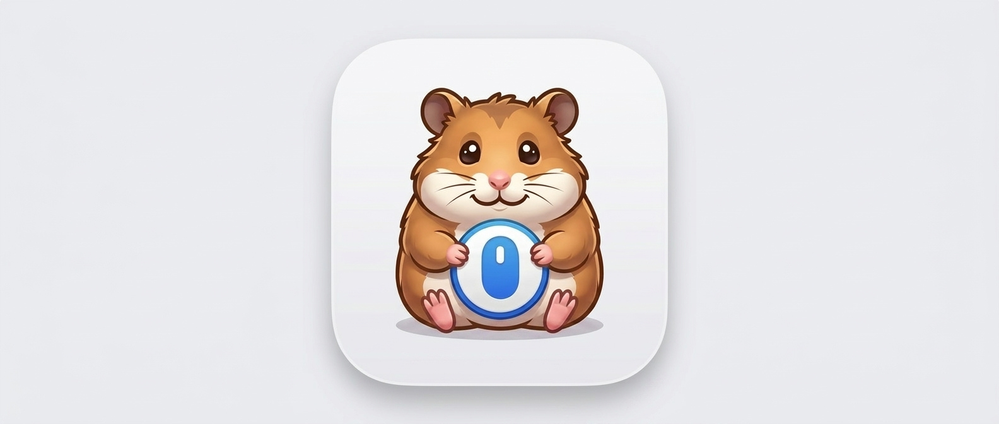

<p align="center">
  
</p>

# OpenMacMouseFix

Map your **middle mouse click** (or any other mouse button) to **Mission Control** — or any other macOS action. Powered by [Hammerspoon](https://www.hammerspoon.org/).

Ships with two one-liner scripts to toggle the mapping on and off. State is persistent across restarts.

### Why not Mac Mouse Fix?

The free version of [Mac Mouse Fix](https://macmousefix.com/) adds noticeable latency to button remaps. This project uses Hammerspoon's low-level event tap, which runs at effectively zero overhead.

---

## Quick start

```bash
# 1. Install Hammerspoon (one-time)
brew install --cask hammerspoon

# 2. Drop the config in place (one-time)
cp hammerspoon/init.lua ~/.hammerspoon/init.lua

# 3. Enable the mapping
./scripts/on.sh

# To disable later:
./scripts/off.sh
```

On first run macOS will ask you to grant Hammerspoon **Accessibility** permission:

> System Settings → Privacy & Security → Accessibility → enable **Hammerspoon**

That's it. Middle-click anywhere now triggers Mission Control. The setting survives reboots because `on.sh` also writes a flag file that `init.lua` reads at launch, and Hammerspoon is configured to auto-launch at login.

You'll also see a **🖱 ON** / **🖱 OFF** toggle in the macOS menu bar — click it to flip the mapping on or off without touching the terminal.

---

## How persistence works

| Piece | Purpose |
|---|---|
| `~/.hammerspoon/init.lua` | The actual mapping logic — runs every time Hammerspoon starts. |
| `~/.hammerspoon/.mmtmc_enabled` | Flag file. Present = ON, absent = OFF. Read by `init.lua` at launch. |
| `hs.autoLaunch(true)` in `init.lua` | Makes Hammerspoon itself start at login. |
| `scripts/on.sh` / `scripts/off.sh` | Create/delete the flag file and flip live state via the `hs` CLI. |
| Menu bar icon (🖱 ON/OFF) | Click to toggle — updates the flag file and event tap together. |

So a reboot sequence looks like: login → Hammerspoon auto-launches → `init.lua` runs → sees flag file → starts the event tap.

---

## Customising your bindings

Edit the `bindings` table at the top of `~/.hammerspoon/init.lua`:

```lua
local bindings = {
  [2] = "mission_control",   -- middle click
  [3] = "app_expose",        -- back button (mouse 4)
  [4] = "show_desktop",      -- forward button (mouse 5)
}
```

### Button numbers

| # | Button |
|---|---|
| 0 | Left click — **don't remap, you'll brick your mouse** |
| 1 | Right click |
| 2 | Middle click |
| 3 | Back (mouse 4) |
| 4 | Forward (mouse 5) |
| 5+ | Extra buttons on gaming/fancy mice |

Not sure what number your mouse reports? Add a debug line inside the event tap:

```lua
print("button:", e:getProperty(hs.eventtap.event.properties.mouseEventButtonNumber))
```

…then open Hammerspoon's console (menu-bar icon → Console) and click.

### Built-in actions

| Action | What it does |
|---|---|
| `mission_control` | Toggle Mission Control |
| `app_expose` | Toggle App Exposé (current app's windows) |
| `show_desktop` | Hide all windows / show desktop |
| `launchpad` | Toggle Launchpad |
| `notification_center` | Toggle Notification Center |
| `spotlight` | Open Spotlight (⌘ Space) |
| `next_space` / `prev_space` | Switch spaces |
| `cmd_tab` | App switcher |
| `quick_note` | Open a Quick Note |
| `lock_screen` | Lock the screen |

### Custom actions

Any value can be a Lua function instead of a string name:

```lua
local bindings = {
  [2] = function() hs.application.launchOrFocus("Safari") end,
  [3] = function() hs.eventtap.keyStroke({"cmd", "shift"}, "4") end, -- screenshot
}
```

After editing, either run `./scripts/on.sh` again or click the Hammerspoon menu-bar icon → **Reload Config**.

---

## Troubleshooting

**Nothing happens on click.** Accessibility permission is the #1 cause. Re-check System Settings → Privacy & Security → Accessibility → Hammerspoon is toggled on. If you reinstall Hammerspoon you may have to remove and re-add the permission.

**Click still reaches the app underneath.** The event tap `return true`s to swallow the click; if that line was edited, the click will fall through.

**`hs` command not found.** Hammerspoon installs it via `hs.ipc.cliInstall()` on first launch. Make sure Hammerspoon has run at least once since the config was placed.

**I want it gone entirely.** `./scripts/off.sh` disables the mapping. To fully remove: quit Hammerspoon, `brew uninstall --cask hammerspoon`, `rm -rf ~/.hammerspoon`.

---

## Project layout

```
.
├── README.md
├── CLAUDE.md              # notes for Claude Code sessions
├── hammerspoon/
│   └── init.lua           # copy to ~/.hammerspoon/init.lua
└── scripts/
    ├── on.sh              # enable + persist
    └── off.sh             # disable + persist
```

The `init.lua` that is actually running lives at `~/.hammerspoon/init.lua`. The copy in this repo is the source of truth — edit it there and copy, or just edit `~/.hammerspoon/init.lua` directly.
